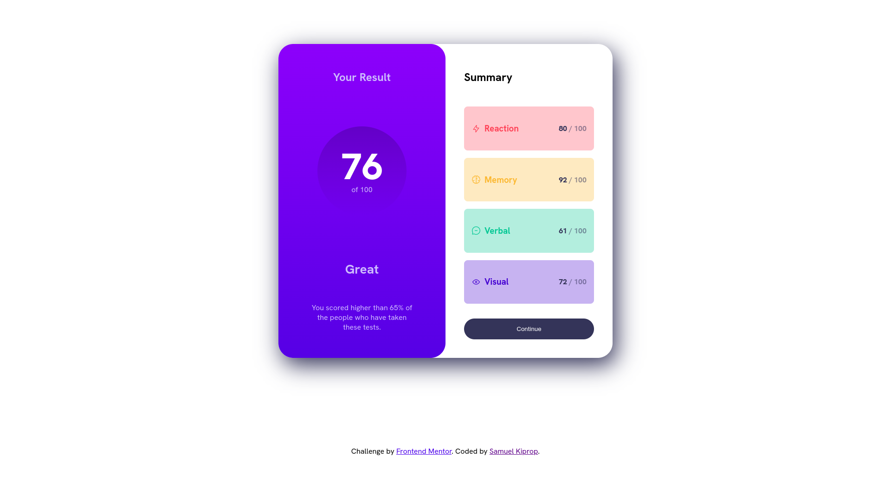

# Frontend Mentor - Results summary component solution

This is a solution to the [Results summary component challenge on Frontend Mentor](https://www.frontendmentor.io/challenges/results-summary-component-CE_K6s0maV). Frontend Mentor challenges help you improve your coding skills by building realistic projects.

## Table of contents

[Frontend Mentor - Results summary component solution](#frontend-mentor---results-summary-component-solution)
- [Frontend Mentor - Results summary component solution](#frontend-mentor---results-summary-component-solution)
  - [Table of contents](#table-of-contents)
    - [The challenge](#the-challenge)
    - [Screenshot](#screenshot)
    - [Links](#links)
    - [Built with](#built-with)
  - [Author](#author)

### The challenge

Users should be able to:

-   View the optimal layout for the interface depending on their device's screen size
-   See hover and focus states for all interactive elements on the page

### Screenshot

### Links

-   [Solution URL](https://github.com/aweSAM-XS/Results-summary-component)
-   [Live Site URL](https://results-component.netlify.app/)

### Built with

-   Semantic HTML5 markup
-   CSS custom properties
-   Flexbox
-   CSS Grid
-   Mobile-first workflow

## Author

-   Website - [awesam.tech](https://awesam.tech)
-   Frontend Mentor - [@awesam-xs](https://www.frontendmentor.io/profile/awesam-xs)
-   Twitter - [@aweSAM](https://www.twitter.com/____awesam____)
